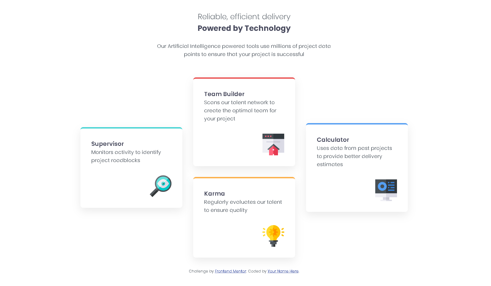

# Frontend Mentor - Four card feature section solution

This is a solution to the [Four card feature section challenge on Frontend Mentor](https://www.frontendmentor.io/challenges/four-card-feature-section-weK1eFYK). 

### The challenge

Users should be able to:

- View the optimal layout for the site depending on their device's screen size

### Screenshot

### Links

- Solution URL: [solution URL ](https://www.frontendmentor.io/solutions/four-card-section-using-css-flexbox-and-grid-jMk4gw-SQD)
- Live Site URL: [ live site URL ](https://four-card-feature-section-master-blush-seven.vercel.app/)

## My process

### Built with

- Semantic HTML5 markup
- Flexbox (mobile)
- CSS Grid (desktop)
- Mobile-first workflow

## Author
Name : Purvesh Patil
